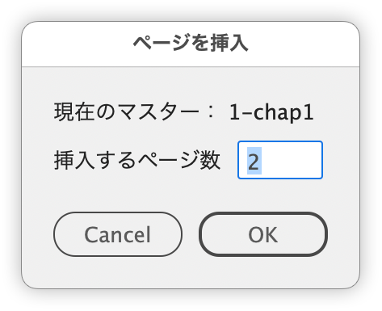

# Adobe InDesign Scripts

- After publication, we continue to fix bugs and make adjustments as we use the scripts in daily work.
- If you encounter any issues or have suggestions like “It didn’t work as expected” or “It would be better if it did this,” we’d appreciate your feedback. If possible, please include the relevant document so we can verify and reproduce the issue (any artwork you send will not be shared externally).

[DTP Transitで公開しているスクリプトについて｜DTP Transit 別館](https://note.com/dtp_tranist/n/n60092f59a341)

## Pages

### Insert pages using the current parent page

By default, InDesign’s “Insert Pages” dialog does not reference the master page of the currently selected page.

This script refers to the master (parent) page of the currently selected page and inserts the specified number of pages directly after the current page.

https://github.com/swwwitch/indesign-scripts/blob/c580906e01ba767b8c08feba7b35deb693ab3a94/jsx/AddPagesUsingCurrentMaster.jsx

### Switch between master and document page

This script allows you to easily toggle between a document page and its applied master page in Adobe InDesign.

- If the active page is a document page, the script switches to its applied master page.
- If the active page is a master page, it switches back to the document page that was active before.

#### Usage Flow:

1. Detect the current active page.
2. If it's a document page, save the current page info and switch to the master page.
3. If it's a master page, return to the previously saved document page.

#### Notes:

- You must have an open document and an active page.
- The document property 'label' is temporarily used to store the original page name.
- Inspired by the idea from: https://creativepro.com/files/kahrel/indesign/go_to_master.html

https://github.com/swwwitch/indesign-scripts/blob/f5c7232f370334665f40ac548002ffc17d141fea/jsx/SwitchToMasterOrDocument.jsx

## Paragraph styles

When the same text is repeated with the same paragraph style, this script appends numbering at the end.

https://github.com/swwwitch/indesign-scripts/blob/509d5929089edb0523461ea2f49b262469fd9a84/jsx/AppendParagraphNumbering.jsx