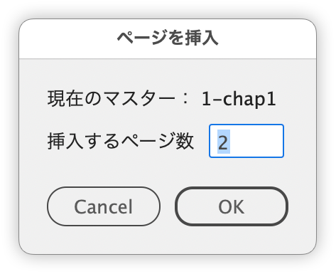
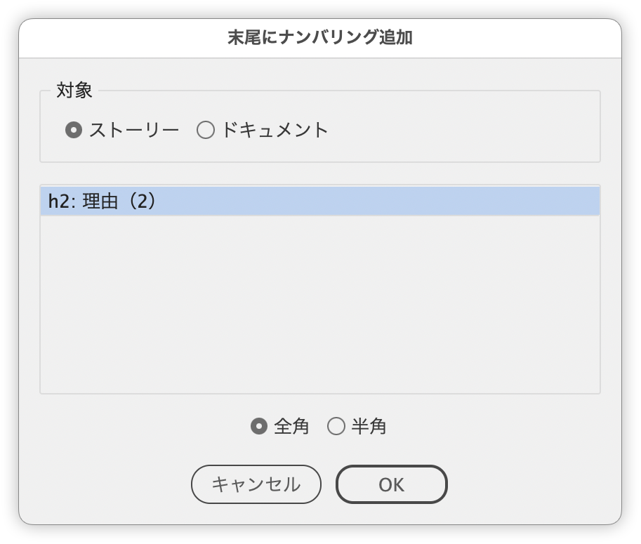

# Adobe InDesign Scripts

アップデート情報（新規／アップデート）は、noteが一番早いです。

[DTP Transit 別館｜note](https://note.com/dtp_tranist)

- 公開後、日々の作業で使う中でバグフィックや調整を行っています。
- 「うまくいかなかった」「こうなるといい」などがあればフィードバックくださいますと助かります。その際、対象となるドキュメントを添えてくださいますと検証しやすいです（いただいたアートワークは外部には公開しません）。

[DTP Transitで公開しているスクリプトについて｜DTP Transit 別館](https://note.com/dtp_tranist/n/n60092f59a341)

## ページ

### 現在の親ページを参照してページ挿入

デフォルトの［ページ挿入］ダイアログボックスは、現在選択しているページのマスターを参照しません。

このスクリプトでは、選択しているページのマスター（親ページ）を参照し、ダイアログボックス指定したページ数だけ現在のページの後に挿入します。

https://github.com/swwwitch/indesign-scripts/blob/c580906e01ba767b8c08feba7b35deb693ab3a94/jsx/AddPagesUsingCurrentMaster.jsx

## 段落スタイル

同じテキストが同じ段落スタイルで繰り返すとき、末尾にナンバリングします。

https://github.com/swwwitch/indesign-scripts/blob/509d5929089edb0523461ea2f49b262469fd9a84/jsx/AppendParagraphNumbering.jsx