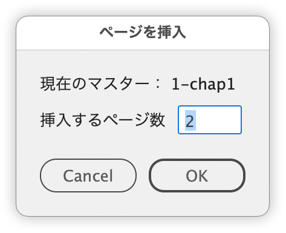
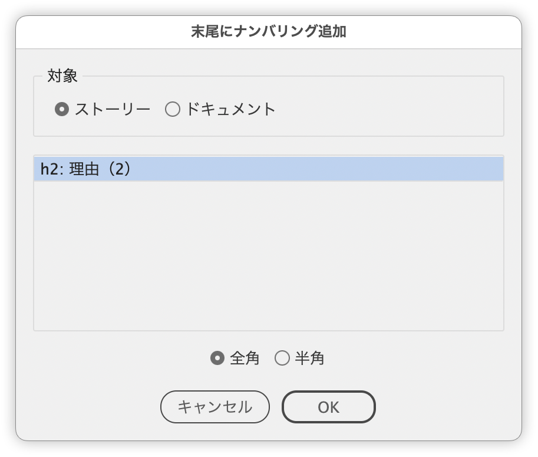
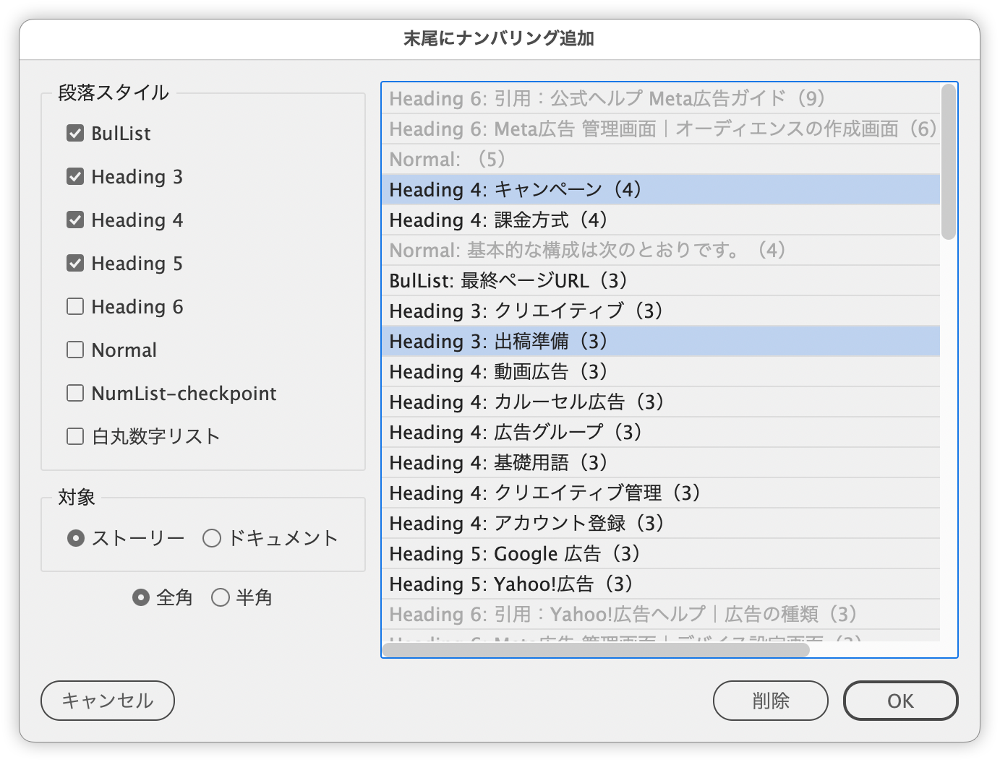
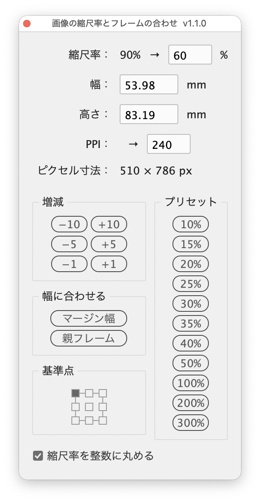

# Adobe InDesign Scripts

アップデート情報（新規／アップデート）は、noteが一番早いです。

[DTP Transit 別館｜note](https://note.com/dtp_tranist)

- 公開後、日々の作業で使う中でバグフィックや調整を行っています。
- 「うまくいかなかった」「こうなるといい」などがあればフィードバックくださいますと助かります。その際、対象となるドキュメントを添えてくださいますと検証しやすいです（いただいたアートワークは外部には公開しません）。

[DTP Transitで公開しているスクリプトについて｜DTP Transit 別館](https://note.com/dtp_tranist/n/n60092f59a341)

## ページ

### 現在の親ページを参照してページ挿入

デフォルトの［ページ挿入］ダイアログボックスは、現在選択しているページのマスターを参照しません。

このスクリプトでは、選択しているページのマスター（親ページ）を参照し、ダイアログボックス指定したページ数だけ現在のページの後に挿入します。

https://github.com/swwwitch/indesign-scripts/blob/main/jsx/page/IdAddPagesUsingCurrentMaster.jsx

### 親（マスター）とドキュメントページの切替

アクティブページがドキュメントページの場合はマスターにジャンプ、マスターページの場合は元のドキュメントページに戻ります。

処理の流れ

1. 現在のページを判定
2. ドキュメントページならマスターへジャンプ
3. マスターページなら元のドキュメントページに戻る

https://github.com/swwwitch/indesign-scripts/blob/main/jsx/page/IdSwitchToMasterOrDocument.jsx

## 段落スタイル

### 同じテキストが同じ段落スタイルの末尾にナンバリング

同じテキストが同じ段落スタイルで繰り返すとき、末尾にナンバリングします。

https://github.com/swwwitch/indesign-scripts/blob/main/jsx/page/IdAppendParagraphNumbering.jsx

#### アップデート

- 段落スタイルをリストアップし、チェックボックスを外したら対象リストから除外（ディム表示）
- ［番号を削除］ボタンを追加 （クリックすると末尾の番号を削除）

## フレーム

### 画像の縮尺率を変更してフレームを合わせる

選択したフレーム内の画像の縮尺率を、パレットで数値・幅・高さ・PPI・プリセット・マージン幅・親フレームの段幅から指定して変更し、フレームを画像に合わせます。値を変えるとその場でドキュメントに反映され、画像を選び替えるだけで次々に作業できます。

https://github.com/swwwitch/indesign-scripts/blob/main/jsx/frame/IdSetImageScale.jsx

詳細：[README](https://github.com/swwwitch/indesign-scripts/blob/main/readme-ja/IdSetImageScale.md)／[note記事](https://note.com/dtp_tranist/n/n91c6a628b7ed)
