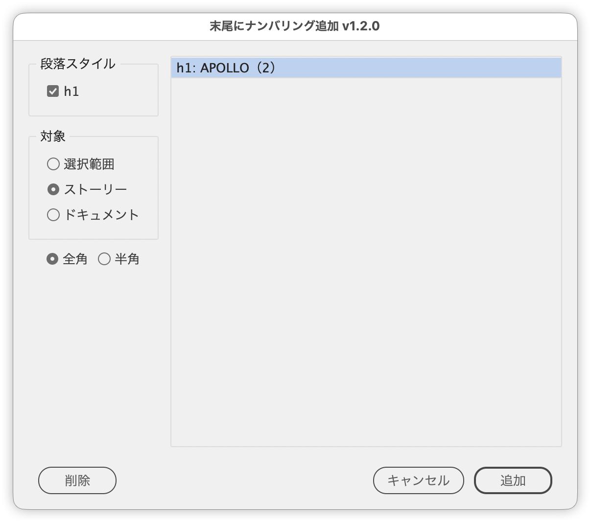

# Number repeated text in the same paragraph style

---

Appends sequential numbering when the same text repeats within the same paragraph style, grouping duplicates by the nearest parent heading.

## Features

- Lists the repeated text by descending occurrence count, with multi-select to pick the targets
- Narrows that list with a checkbox per paragraph style
- Switches the scope between selection, story, and document
- Switches between full-width and half-width brackets (Japanese UI only)
- Includes a Delete button that strips existing numbering

## Usage

1. Open the target document
2. Run the script (the dialog opens once the analysis finishes)
3. Pick the entries to number from the list on the right (multiple selection is allowed)
4. Choose the scope, then click Add

To strip existing numbers, select the entries the same way and click Delete.

## How duplicates are judged

Paragraphs are grouped when their paragraph style, their text, and their nearest parent heading all match. Only groups that occur at least twice appear in the list.

Only the paragraph style names defined in `HEADING_LEVEL_MAP` (`h1`–`h6` / `Heading 1`–`Heading 6`) count as parent headings. Documents using any other naming are treated as having no parent, so grouping falls back to paragraph style plus text. Add your own heading style names to `HEADING_LEVEL_MAP` if needed.

## Notes and limitations

- Targets the active document.
- Text on parent (master) pages is excluded.
- Paragraphs styled `p.img` or `p.table` are excluded (configurable via `IGNORE_STYLE_NAMES`).
- Text of one character or less is excluded.
- If Selection is chosen with nothing selected, the script reports it and falls back to a wider scope.
- Both numbering and removal are a single undo step.

## Script info

| Item | Value |
| --- | --- |
| File | `jsx/page/IdAppendParagraphNumbering.jsx` |
| Version | v1.2.0 |
| Author | Masahiro Takano (@swwwitch) |
| First release | 2025-06-30 |
| Last updated | 2026-08-13 |
| Article | https://note.com/dtp_tranist/n/nc96549bb60f9 |

## Changelog

### v1.2.0 (2026-08-13)

- Added a Selection scope, so numbering can be limited to the selected text range
- Fixed paragraphs without a recognized parent heading being dropped. Only the names in `HEADING_LEVEL_MAP` count as headings, so documents using any other heading style found no targets at all
- Fixed selected targets being silently skipped when the document contained empty paragraphs or single-character headings
- Fixed the Cancel button not closing the dialog in the Japanese UI
- Text frames on parent pages are now excluded correctly even when they sit inside a group
- The dialog now closes when Delete runs, instead of leaving a stale list behind
- Added messages for "no document open" and for a scope with nothing selected
- Renamed OK to Add and rearranged the buttons into left (Delete) and right (Cancel, Add)
- Sped up the analysis pass

## License

MIT License — <http://opensource.org/licenses/mit-license.php>
