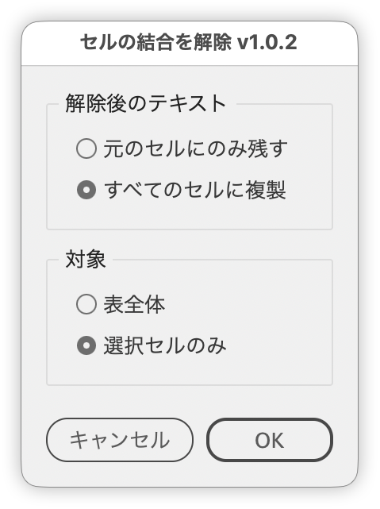

# Unmerge cells in a table

---

Unmerges merged table cells, with dialog options for what happens to the original text and for the target scope.

## Features

- Choose between Keep in the original cell and Copy to all cells
- Target the whole table or only the selected cells
- Scope opens on Selected cells only when the run starts from a partial selection
- Copying is limited to the cells produced by that merged cell
- Cells selected more than once are processed only once
- Tooltips on each panel explain the options

## Usage

1. Select a table or cells inside a table
2. Run the script
3. Choose what happens to the text and the scope, then click OK

## Notes and limitations

- Copy to all cells puts the same text into every cell produced by that merged cell. Neighbouring cells are left untouched.
- The copied text is the text the merged cell was showing. Formatting is not carried over; the text is inserted as plain text.
- Scope only switches its default for a cell selection. Placing the text cursor inside a cell opens on Whole table.
- A failure on one cell does not abort the whole run.
- The whole run collapses into a single undo step.

## Script info

| Item | Value |
| --- | --- |
| File | `jsx/table/IdCellUnmerge.jsx` |
| Version | v1.0.2 |
| Author | Masahiro Takano (@swwwitch) |
| First release | 2026-04-17 |
| Last updated | 2026-09-16 |
| Article | https://note.com/dtp_tranist/n/n175525637a3d |

## Changelog

### v1.0.2 (2026-09-16)

- Reworded the UI to match what the script does. Distribute text copies the same string, so it is now Copy to all cells, and its counterpart is Keep in the original cell
- Renamed the Merge panel to Text after unmerge; it holds the text options, not merge settings
- Aligned the Japanese dialog title and undo name with the InDesign menu wording (the English ones already matched)
- Scope now opens on Selected cells only when the script is run from a partial selection
- Added tooltips to the Text after unmerge and Scope panels
- The no-table alert now appears before the dialog instead of after it
- Renamed variables and functions to match their actual roles (no behavior change)

### v1.0.1 (2026-08-27)

- Fixed Selected cells only, where cells were left merged or picked up text from another cell. The cause was treating `contents` of a merged cell as a string when it returns an array of the constituent cells' texts
- Limited Distribute text to the cells produced by that merged cell
- Fixed Whole table missing merged cells. Each unmerge changed the cell count and shifted the references that followed
- Wrapped the whole script in an IIFE so nothing leaks into the global scope

## License

MIT License — <http://opensource.org/licenses/mit-license.php>
