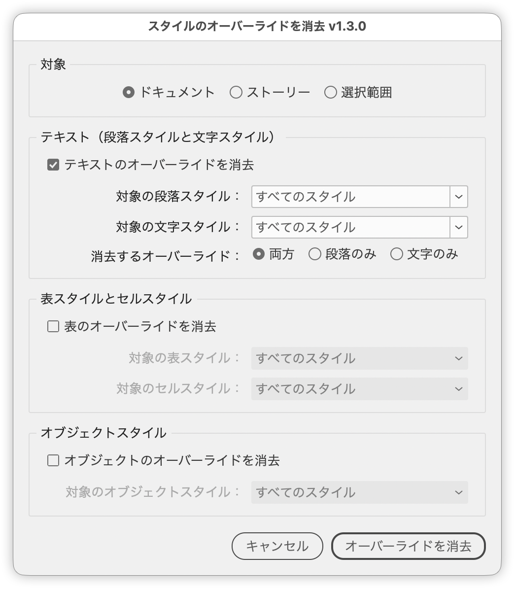

# Clear style overrides from text, tables and objects

---

Clears style overrides — manual formatting applied on top of a style — from text, tables and objects in one pass. It does across a whole document, a story or just the current selection what you would otherwise do one place at a time in the styles panels.

## Features

- Scope can be Document, Story, or Selection
- Text, table & cell styles, and object styles can each be switched on or off independently
- Processing can be narrowed by paragraph, character, table, cell or object style
- Overrides to clear can be Both, Paragraph only, or Character only
- Table style and cell style overrides are cleared together
- Footnotes, text on parent (master) pages, and text inside tables are included
- The run button is disabled when nothing is set to be processed
- The whole run is a single undo step

## Usage

1. Open a document (select something first if you plan to use Story or Selection)
2. Run the script
3. Choose the scope, what to process, the overrides to clear and any style filters, then click **Clear overrides**

## Scope

| Choice | Text and tables | Objects |
| --- | --- | --- |
| Document | The whole document | Every frame, including those on parent (master) pages |
| Story | The entire story containing the selection, across all threaded frames | The text frames of that story |
| Selection | The selected text (a selected cell or frame works too) | The selected objects |

With the scope set to Selection and cells selected, the cell style overrides of those cells are cleared, along with the table style overrides of the table they belong to. Other cells in the table are left alone. To process every cell, select the frame holding the table or choose Story instead.

## Overrides to clear

InDesign keeps deviations from a paragraph style at two levels.

| | Paragraph level | Character level |
| --- | --- | --- |
| Typical attributes | Alignment, indents, space before/after, tabs, drop caps, paragraph rules, keep options, hyphenation, kinsoku set, mojikumi set | Font, size, weight, **leading**, kerning, tracking, text color, baseline shift, horizontal/vertical scale |

Leading sitting on the character side is counterintuitive, but in InDesign leading is a character attribute — that is why it can vary within a single paragraph.

The split matches the modifier keys on the Clear Overrides button at the bottom of the Paragraph Styles panel.

| This script | Paragraph Styles panel |
| --- | --- |
| Both | Click |
| Paragraph only | Cmd (Ctrl) + click |
| Character only | Cmd+Shift (Ctrl+Shift) + click |

### Example

A paragraph with the paragraph style "Body" applied, then manually centered with part of it set in bold:

- **Both** → alignment returns to left and the bold is removed
- **Paragraph only** → alignment returns to left, but the bold stays
- **Character only** → it stays centered, but the bold is removed

**Character only** is the one to reach for when you want to keep the alignment and spacing you set deliberately during layout, but strip the font settings that came in with pasted text.

## Notes and limitations

- Applied character styles are not removed. Only manual formatting — the overrides themselves — is cleared. To remove a character style, apply `[None]` separately.
- Locked layers and locked stories are skipped.
- With the scope set to Selection, a bare caret in text counts as no selection. Use Story if you want the whole story processed.
- The style dropdowns also list `[None]`, which lets you process only the places where no style is applied.
- Documents with a lot of content take a while.

## Script information

| Item | Value |
| --- | --- |
| File | `jsx/style/IdClearStyleOverrides.jsx` |
| Version | v1.3.2 |
| Original author | Gregor Fellenz (grefel) |
| Modified by | Masahiro Takano (@swwwitch) |
| First release | 2020-06-09 |
| Last updated | 2026-09-20 |

## Version history

- **v1.3.2** (2026-09-20) — Fixed an error (`Object does not support the property or method 'appliedTableStyle'`) that stopped the script when cells were selected with the scope set to Selection.
- **v1.3.1** (2026-09-20) — Fixed a bug where only some of the selected cells were processed when several cells were selected.
- **v1.3.0** (2026-09-20) — Added scope (Document / Story / Selection), override type (Both / Paragraph only / Character only) and filtering by cell style. Japanese and English localization.
- **v1.2.0** (2020-06-09) — Original work (Gregor Fellenz / grefel/clearOverrides)

## License

GNU General Public License v3.0 — <https://www.gnu.org/licenses/gpl-3.0.txt>

Derived from [grefel/clearOverrides](https://github.com/grefel/clearOverrides), which is licensed under GPL v3. As a derivative work, this script is distributed under GPL v3 as well. The full license text ships alongside the script as `jsx/style/IdClearStyleOverrides-LICENSE.txt`.
