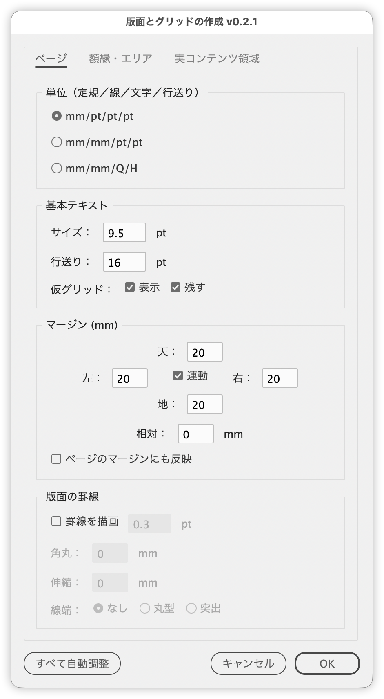
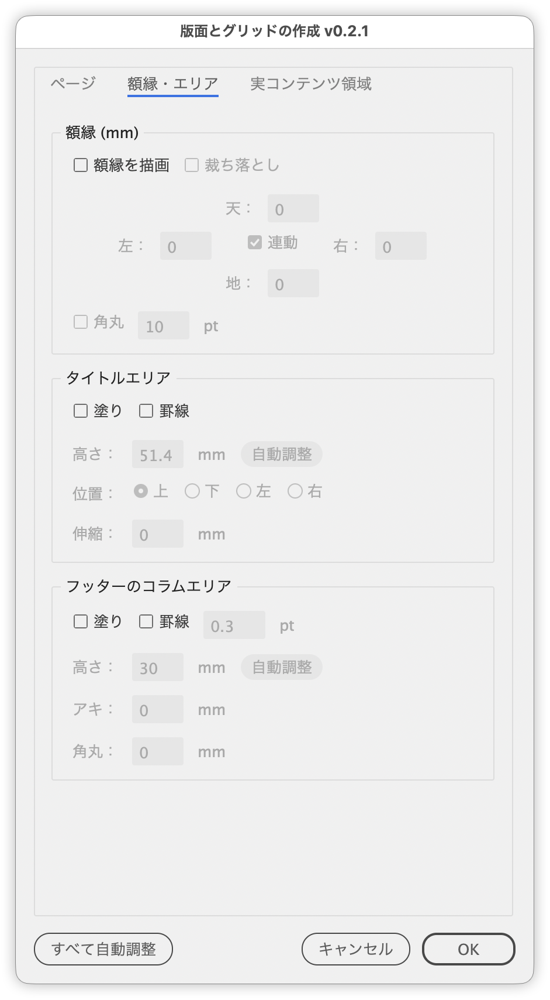
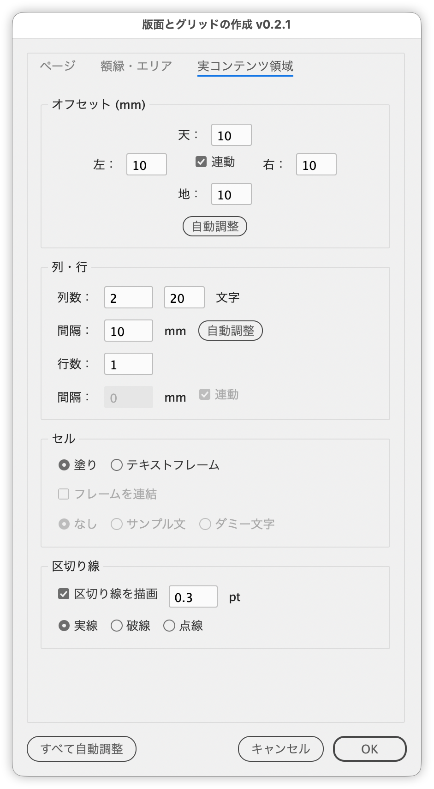

# Build a page grid with a live preview

---

Builds a type area border, title area, footer column area, page frame, a column/row grid and dividers on the active page in one pass, with a live preview.

## Features

The dialog has three tabs.

**Page**

- Switch the input units for stroke weights and base text (pt / mm, pt / Q and H)
- Show a temp grid at the line positions given by the base text size and leading, and optionally keep it on a non-printing layer after OK
- Set the margins per side (with Link and Relative). Apply to page margins also updates the page's Margins and Columns settings
- Type area border (weight, corner radius, extension, cap style)

**Frame & Areas**

- Page frame: a fill around the page, with per-side insets, rounded opening corners and a 3 mm bleed option
- Title area: fill and/or border on the top, bottom, left or right of the type area
- Footer column area: fill and/or border below the type area

**Content Region**

- A grid of cells in the type area minus the title and column areas, with offsets
- Cells are either fills or text frames (threaded, with sample text or placeholder characters)
- Dividers centered in the column and row gaps (solid, dashed or dotted)
- Shows the characters per column; entering a count recalculates the column gap

**Common**

- The Auto buttons in each panel and Auto All at the bottom snap lengths to temp grid lines or multiples of the font size
- The preview is redrawn every time a setting changes

## Usage

1. Make the target page active
2. Run the script
3. Configure each tab, check the preview, then click OK

Everything the script creates can be undone in a single step.

## Notes and limitations

- Length fields use the document ruler unit. The default margins come from the page; other defaults are defined in mm and converted to the ruler unit.
- Positions are calculated in spread coordinates so right-hand pages of spreads line up. The page frame bleed is not extended on the spine side.
- Dashed and dotted dividers use the document stroke styles "破線 (3 & 2)" and "点線 (1 & 1)". If they are missing, solid lines are drawn and you are told on OK.
- The sample text uses Hiragino Kaku Gothic W3 (ProN, Pro, then Sans). If none is installed, the font is left unchanged.
- The preview is drawn on a "__QuickLayoutPreview__" layer, which is removed when the dialog closes.

## Script info

| Item | Value |
| --- | --- |
| File | `jsx/page/IdLayoutGridBuilder.jsx` |
| Version | v1.0.0 |
| Author | Masahiro Takano (@swwwitch) |
| First release | 2026-03-13 |
| Last updated | 2026-09-25 |

## Changelog

### v1.0.0 (2026-09-25)

**Interface**

- Replaced the three-column dialog with three tabs: Page, Frame & Areas, and Content Region
- Renamed the dialog and undo name from Quick Layout to Layout Grid Builder
- Renamed the fill around the page to Page Frame, the Type Area panel to Type Area Border, the Fill sub-panel to Cells, the title area Length to Height, and Content Area to Type Area
- Laid out the margin fields like the page frame fields and added Link
- Narrowed the offset fields and show them to one decimal place (calculations use the unrounded values)
- The first unit in the Units choices now shows the document ruler unit (it always said mm before)
- Removed the Preview checkbox; the preview is now always shown
- Added colons to field labels and tooltips to controls whose effect is not obvious

**Features**

- Added Apply to page margins, which also updates the page's Margins and Columns settings on OK
- Added a Corner radius option (in points) to the page frame that rounds the corners of the opening
- The page frame bleed is now 3 mm instead of 3 ruler units
- Renamed the bottom Auto button to Auto All; it no longer changes the title or column area values while those areas are off
- Arrow keys now also step by 0.1 with Option (Alt)

**Fixes**

- Stroke weights, font size, leading and corner radii are now applied in points, fixing wrong sizes in documents whose stroke or text units are not points
- Reviewed unit conversions: exact pt-to-mm and pt-to-Q factors, and the ruler unit scale is now measured from the page (some units, such as agates, were treated as points). Default top and bottom margins are converted from the vertical unit
- Fixed the sample text font (Hiragino Kaku Gothic W3) never being applied
- Fixed the column area Gap being tied to the type area Border checkbox
- Fixed Corner Radius and the stroke weight being disabled when the type area border is off, although the title area also uses them
- Fixed the missing dashed/dotted stroke style warning appearing on every preview update (it now appears once on OK)

## License

MIT License — <http://opensource.org/licenses/mit-license.php>
