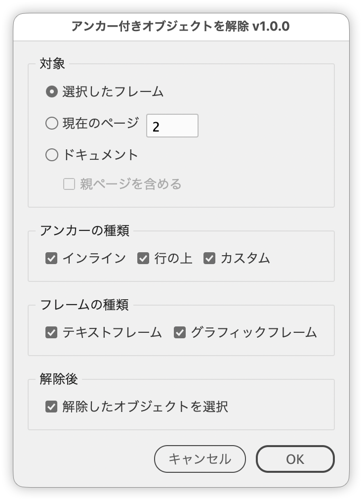

# Release anchored objects in bulk

---

Releases the anchored objects in the selected frames, on a chosen page, or throughout the document, filtered by anchor type and frame type.

## Features

Does the same as Object > Anchored Object > Release in one pass, without selecting anything or using the menu. Released objects stay where they are.

### Target

- **Selected Frames**: the selected anchored objects, plus any inside the selected text frames or text
- **Current Page**: shows the page number next to it; change it to target another page (Up/Down arrow keys move between pages, add Shift to move 10 pages)
- **Document**: everything in the document. Include Parent Pages also covers anchored objects on parent pages

### Filters

- **Anchor Type**: Inline, Above Line, Custom
- **Frame Type**: Text Frames, Graphic Frames (rectangles, ellipses and polygons, including empty frames)
- Option-click a checkbox to turn off all the others; Option-click it again to turn them all back on

### After release

- Select Released Objects leaves the released objects selected, ready for moving or aligning
- Shows how many objects were released, and how many were skipped because they could not be released
- The whole run is a single undo step (Cmd+Z)
- Every option carries a tooltip describing what it does

## Usage

1. If needed, select anchored objects (or the text frames or text that contain them)
2. Run the script
3. Choose the target, anchor types and frame types, then click OK

## Notes and limitations

- Selected Frames is the default when the selection contains anchored objects; otherwise Current Page is, and Selected Frames is disabled.
- The type checkboxes and Select Released Objects are on by default; Include Parent Pages is off.
- At least one Anchor Type and one Frame Type must be checked before OK becomes available.
- If the page number does not exist, clicking OK shows a message and returns to the dialog.
- Current Page does not cover anchored objects in overset text or in text frames on the pasteboard.
- Objects that cannot be released (locked objects, for example) are skipped.
- When the released objects span several spreads, only those on the spread currently shown are selected.

## Script info

| Item | Value |
| --- | --- |
| File | `jsx/frame/IdReleaseAnchoredObjects.jsx` |
| Version | v1.0.0 |
| Author | Masahiro Takano (@swwwitch) |
| First release | 2026-09-25 |
| Last updated | 2026-09-25 |
| Article | https://note.com/dtp_tranist/n/ne3ee16f466bf |

## Change log

### v1.0.0 (2026-09-25)

- First release

## License

MIT License — <http://opensource.org/licenses/mit-license.php>
