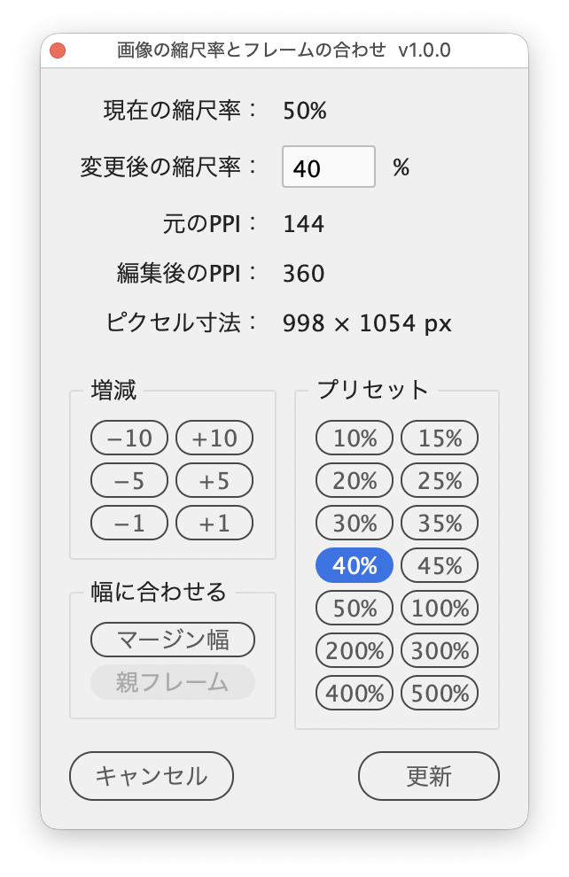

# Change image scale and fit the frame

---

Changes the scale of the image in each selected frame, set from a palette by value, preset, margin width or parent column width, and fits the frame to the image.

## Features

Changes are applied to the document as you edit, so you can check the look and resolution while choosing the scale.

### Display

- **Current scale**: scale of the selected images. Shows "25% / 30%" when horizontal and vertical differ, or "Mixed" when the images differ
- **New scale**: the scale to apply (Up/Down arrow keys change it by 1, add Shift to change it by 10)
- **Actual PPI**: resolution of the image file itself (Actual PPI in the Links panel)
- **Effective PPI**: resolution after scaling (Effective PPI in the Links panel); updates as you change the value
- **Pixel size**: width × height of the image in pixels

### Setting the scale

- **Adjust**: −10/+10, −5/+5, −1/+1. The ±5 and ±10 buttons snap to multiples of 5 or 10 (23% with +5 gives 25%)
- **Presets**: 10%, 15%, 20%, 25%, 30%, 35%, 40%, 45%, 50%, 100%, 200%, 300%, 400%, 500%
- **Fit width**
  - **Margins**: scales each image to fit the page margin width and moves the frame's left edge to the left margin
  - **Parent Frame**: scales each anchored image to fit the column width of its text frame (excluding insets and the paragraph's left and right indents)

### Keeping and reverting

- **Refresh**: keeps the changes so far and reloads the currently selected frames
- **Cancel**: reverts the changes since the last Refresh (or since opening) and closes
- Closing the window with its close button keeps the changes
- Changes are a single undo step (Cmd+Z)
- Every option carries a tooltip describing what it does

## Usage

1. Select frames that contain placed images (you can also open the palette with nothing selected, then select and click Refresh)
2. Run the script
3. Type a scale or set it with the buttons
4. Check the result, then close the window with its close button (to continue with other images, select them and click Refresh)

## Notes and limitations

- Targets are rectangle frames that each contain a single image or PDF. Ellipse and polygon frames, and images selected directly, are not covered.
- Images with different horizontal and vertical scales become uniform when changed. When the current scales differ between axes or between images, New scale starts at 10%.
- Margins and Parent Frame round the scale down to a whole number. When the result differs between frames, the field shows "Varies".
- Margins does not move anchored frames. On left-hand pages of facing-page documents, inside and outside margins are swapped.
- Parent Frame leaves frames that are not anchored, and images in overset text, unchanged. The button is disabled when no frame applies.
- PDFs have no PPI or pixel size, so "—" is shown.
- If you do something else in the document while the palette is open, Cancel no longer reverts the changes made before that.
- Running the script again while the palette is open closes the old palette (keeping its changes) and opens a new one.
- InDesign cannot change a document while a modal dialog is open, so the script uses a palette to preview changes.

## Script info

| Item | Value |
| --- | --- |
| File | `jsx/frame/IdSetImageScale.jsx` |
| Version | v1.0.0 |
| Author | Masahiro Takano (@swwwitch) |
| First release | 2026-09-26 |
| Last updated | 2026-09-26 |
| Article | https://note.com/dtp_tranist/n/n91c6a628b7ed |

## Change log

### v1.0.0 (2026-09-26)

- First release

## License

MIT License — <http://opensource.org/licenses/mit-license.php>
