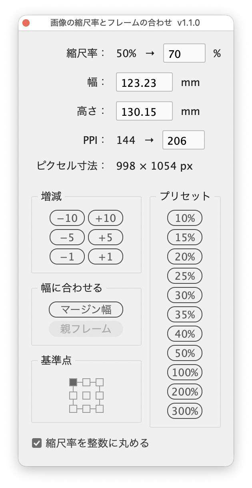

# Change image scale and fit the frame

---

Changes the scale of the image in each selected frame, set from a palette by value, width, height, PPI, preset, margin width or parent column width, and fits the frame to the image.

## Features

Changes are applied to the document as you edit, so you can check the look and resolution while choosing the scale. The palette can stay open; just select the next image to keep going.

### Display and input

- **Scale**: "current scale → [field] %" (e.g. 30% → [57] %)
  - The current scale shows "25% / 30%" when horizontal and vertical differ, or "Mixed" when the images differ
- **Width** / **Height**: width and height of the image in mm. Type a value to scale each image to that size
- **PPI**: "actual PPI → [effective PPI field]" (e.g. 144 → [360]), matching Actual PPI and Effective PPI (horizontal) in the Links panel. Type a PPI to scale each image to that resolution
- **Pixel size**: width × height of the image in pixels

The Scale, Width, Height and PPI fields are linked: changing one updates the others. In every field, Up/Down arrow keys change the value by 1, add Shift to change it by 10.

### Setting the scale

- **Adjust**: −10/+10, −5/+5, −1/+1
- **Presets**: 10%, 15%, 20%, 25%, 30%, 35%, 40%, 50%, 100%, 200%, 300%
- **Fit width**
  - **Margins**: scales each image to fit the page margin width and moves the frame's left edge to the left margin
  - **Parent Frame**: scales each anchored image to fit the column width of its text frame (excluding insets and the paragraph's left and right indents)
- **Reference point**: the point of the frame chosen on the 9-point grid (top-left by default) stays where it was after scaling
- **Round scale to whole numbers** (at the bottom of the palette, on by default): makes the applied scale a whole number

### Keeping and reverting

- Changing the selection keeps the changes so far and loads the newly selected frames automatically
- Close the window with its close button (the changes are kept)
- The changes to one set of targets are a single undo step (Cmd+Z)
- Every option carries a tooltip describing what it does

## Usage

1. Select frames that contain placed images (you can also open the palette with nothing selected and select them afterwards)
2. Run the script
3. Type a scale, width, height or PPI, or set it with the buttons
4. Select the next image and repeat step 3
5. When you are done, close the window with its close button

## Notes and limitations

- Targets are rectangle frames that each contain a single image or PDF. Ellipse and polygon frames, and images selected directly, are not covered.
- Images with different horizontal and vertical scales become uniform when changed. When the current scales differ between axes or between images, the Scale field starts at 10%.
- With Round scale to whole numbers on:
  - Typed scales are rounded
  - Width, Height and PPI input, Margins and Parent Frame round down so the image never overflows (and the PPI never falls below the value)
  - ±1 gives whole numbers and ±5 / ±10 snap to multiples of 5 or 10 (23% with +5 gives 25%)
- With it off, nothing is rounded: typed and stepped values are used as is, and Width, Height, PPI and the fit buttons use the exact scale.
- When Width, Height, PPI, Margins or Parent Frame give a different scale for each frame, the Scale field shows "Varies".
- Anchored frames are not moved (the reference point does not apply). With Margins, the horizontal position follows the left margin.
- Margins swaps inside and outside margins on left-hand pages of facing-page documents.
- Parent Frame leaves frames that are not anchored, and images in overset text, unchanged. The button is disabled when no frame applies.
- PDFs have no PPI or pixel size, so "—" is shown, and typing a PPI does not change them.
- Running the script again while the palette is open closes the old palette (keeping its changes) and opens a new one.
- InDesign cannot change a document while a modal dialog is open, so the script uses a palette.

## Script info

| Item | Value |
| --- | --- |
| File | `jsx/frame/IdSetImageScale.jsx` |
| Version | v1.1.1 |
| Author | Masahiro Takano (@swwwitch) |
| First release | 2026-09-26 |
| Last updated | 2026-09-26 |
| Article | https://note.com/dtp_tranist/n/n91c6a628b7ed |

## Change log

### v1.1.1 (2026-09-26)

- Fixed the actual PPI sometimes not being shown

### v1.1.0 (2026-09-26)

- Removed the Refresh and Cancel buttons; the palette now loads the selection automatically when it changes
- Scale can be set by typing a width, height (mm) or PPI
- Scale and PPI are each shown on one line as "current → field"
- Added a 9-point reference point
- Added Round scale to whole numbers (when off, the fit buttons do not round either)
- Revised the presets (removed 45%, 400% and 500%) and arranged them in one column

### v1.0.0 (2026-09-26)

- First release

## License

MIT License — <http://opensource.org/licenses/mit-license.php>
