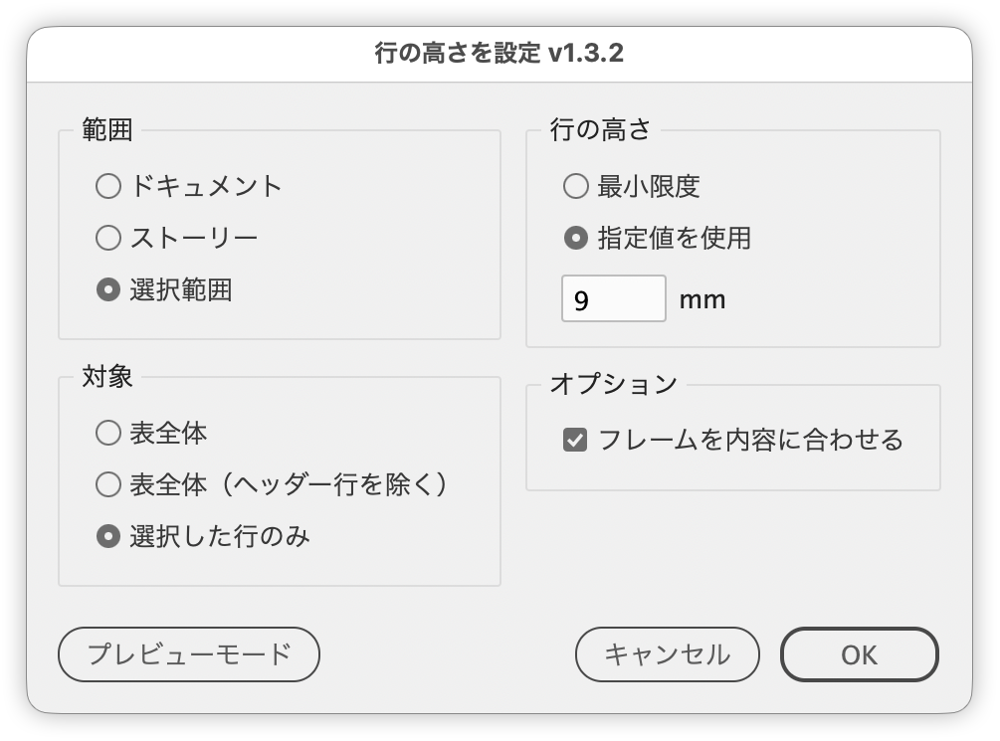

# Set table row heights with a preview

---

Sets table row heights with a live preview, choosing the scope (selection / story / document) and which rows to target.

## Features

- Scope can be the selection, the story, or the whole document, applying to several tables at once
- Target the whole table, the whole table except header rows, or only the selected rows
- Row height can be At Least (minimum) or Exactly (a specified value)
- The initial value comes from the current row height (the shared value, or the average of non-header rows)
- Fit Frame to Content (on by default) fits the height of the text frame containing the table to its content, including in the preview
- The Preview Mode button switches the screen mode to hide guides and frame edges

## Usage

1. Select a table, a cell, or a text frame containing a table
2. Run the script
3. Choose the scope, target and height, then click OK

## Notes and limitations

- "Selected Rows Only" is available only when the scope is Selection.
- Selections that mix multiple tables are treated as an error.
- Values are shown and entered in the document's vertical units and converted to points internally.

## Script info

| Item | Value |
| --- | --- |
| File | `jsx/table/IdTableRowHeightManager.jsx` |
| Version | v1.3.2 |
| Author | Masahiro Takano (@swwwitch) |
| First release | 2026-04-20 |
| Last updated | 2026-09-25 |
| Article | https://note.com/dtp_tranist/n/n9f95f8e98db6 |

## License

MIT License — <http://opensource.org/licenses/mit-license.php>
