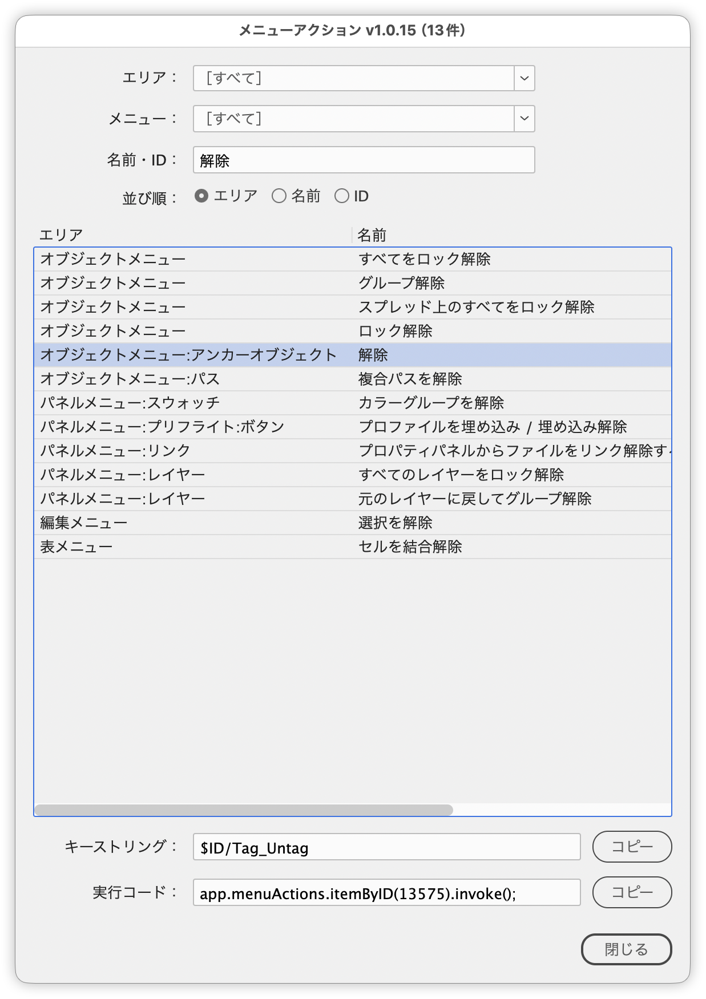

# メニューアクションを調べて実行コードをコピー

[](https://github.com/swwwitch/indesign-scripts/blob/main/jsx/misc/IdMenuActionsViewer.jsx)

[](https://github.com/swwwitch/indesign-scripts/blob/main/readme-en/IdMenuActionsViewer.md)

[](https://github.com/swwwitch/indesign-scripts/blob/main/README.md)

---

InDesign のメニューアクション（メニューコマンド）を一覧し、カテゴリ・エリア・名前・ID で絞り込んで調べます。選択したアクションのキーストリング（`$ID/…`）と、スクリプトから実行するためのコードをコピーできます。

Peter Kahrel 氏の `menu_actions.jsx` をもとに改変したものです。



## 主な機能

- メニューアクションを「名前｜エリア」の2列のリストで表示
- 絞り込み
  - **カテゴリ**：エリア名の「:」より前の部分（編集メニュー、パネルメニューなど）で絞り込み。メニュー関連を上、それ以外を区切り線の下に並べる。エリアの候補も絞られる
  - **エリア**：エリアを1つ選んで絞り込み
  - **名前・ID**：名前に含まれる文字で絞り込み（大文字小文字を区別しない。正規表現も可）。数字だけを入れると、その ID のアクションも対象にする
- 並び順をラジオボタンで切り替え（名前／エリア。初期値はエリア）
- リストで選択したアクションの情報を、リストの下に自動で表示
  - **キーストリング**：`$ID/Find/Change...` など（複数ある場合は「 | 」区切り）
  - **実行コード**：`app.menuActions.itemByID(18694).invoke();`
- それぞれ［コピー］ボタンでクリップボードにコピー
- 絞り込んだ結果が1件なら、自動で選択して情報を表示
- 読み込み中は進行状況バーを表示
- ダイアログのタイトルに表示中の件数を表示

## 使い方

1. スクリプトを実行する
2. カテゴリ・エリア・名前・ID で目的のアクションを絞り込む（名前・ID は入力するたびに絞り込まれる）
3. リストでアクションを選択する
4. 実行コードまたはキーストリングの［コピー］をクリックし、自分のスクリプトに貼り付ける

コピーした実行コードは、次のように使えます。

```javascript
app.menuActions.itemByID(18694).invoke();
app.menuActions.item("$ID/Find/Change...").invoke();
```

## 制限事項・メモ

- フォント名・スタイル名（ID 57603〜61066）、最近使用したファイル・スクリプト名（`.indd` `.jsx` `.jsxbin`）、文字や数字を含まない名前（「(」「)」だけなど）、［ウィンドウ］メニューのドキュメント名、英語版の「Text Selection」「Menu:Insert」エリアは一覧に出しません。
- リストの名前は20文字を超えると末尾を「…」にして表示します（Mac の ScriptUI は1列目を最も長い文字列の幅まで広げるため）。絞り込みは全文で行います。
- カテゴリの候補は、実際のエリア名から自動で作ります。InDesign のバージョンや言語によって候補が変わります。
- 実行コードの ID は InDesign のバージョンや環境によって変わることがあります。配布するスクリプトでは、キーストリング（`$ID/…`）を使う方法も検討してください。
- クリップボードへのコピーは、Mac では AppleScript、Windows では VBScript を経由します。
- 名前・ID は入力するたびに一覧を作り直します。件数が多いと、1文字ごとに少し待たされることがあります。
- Enter／Return と Esc でダイアログを閉じます。

## オリジナル、謝辞

Peter Kahrel 氏の `menu_actions.jsx` をもとにしています。便利なスクリプトを公開してくださっている Peter Kahrel 氏に感謝します。

- https://creativepro.com/menu_actions/
- http://kasyan.ho.com.ua/open_menu_item.html

オリジナルからのおもな変更点：

- 常駐パレットからモーダルダイアログに変更
- カテゴリ・エリア・名前／ID での絞り込み（組み合わせ可）
- 並べ替えの高速化（約4秒 → 約0.05秒）と、名前／エリアの切り替え
- 選択したアクションのキーストリングと実行コード（`app.menuActions.itemByID(…).invoke();`）の表示とコピー
- 日本語／英語の UI

## スクリプト情報

| 項目 | 内容 |
| --- | --- |
| ファイル | `jsx/misc/IdMenuActionsViewer.jsx` |
| バージョン | v1.0.24 |
| 原作 | Peter Kahrel |
| 改変 | Masahiro Takano (@swwwitch) |
| 初回リリース | 2026-09-25 |
| 最終更新 | 2026-09-25 |
| 紹介記事 | https://note.com/dtp_tranist/n/n5038c9d2cc85 |

## 更新履歴

- v1.0.24（2026-09-25）：初版

## ライセンス

原作 `menu_actions.jsx` の著作権は Peter Kahrel 氏に帰属します。改変版の公開について、現在、原作者に許可を確認中です。許可が得られた場合は、改変部分を MIT License で公開します。

- 改変部分：Copyright (c) 2026 Masahiro Takano (@swwwitch)
- MIT License — <http://opensource.org/licenses/mit-license.php>
