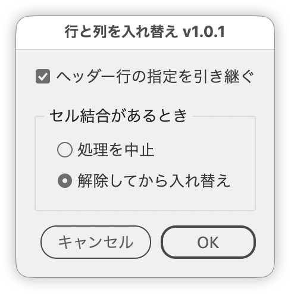

# 表の行と列を入れ替え

---

表の中を選択して実行すると、その表全体の行と列を入れ替えます。ヘッダー行の指定を引き継ぐかと、セル結合の扱いをダイアログで選べます。

## 主な機能

- カーソル位置・数文字の選択・複数セル・全セルのいずれからでも、その表全体を対象に
- テキスト内容に加えて、文字サイズ・フォント・文字色・セルの塗り色・ティントも入れ替え
- セル結合がある場合は「処理を中止」「解除してから入れ替え」を選択
- ヘッダー行の指定を転置後に引き継ぐかをチェックボックスで指定（転置の対象は常に表全体）
- フッター行の設定も可能な範囲で復元

## 使い方

1. 表の中にカーソルを置くか、セルや文字を選択する
2. スクリプトを実行する
3. ヘッダー行の引き継ぎとセル結合の扱いを指定して［OK］

## 制限事項・メモ

- 選択が表の中にあれば、その表全体が対象です。部分的に選んでも選択範囲だけを入れ替えることはできません。
- 表が入れ子になっている場合は、選択のある内側の表が対象になります。
- ヘッダー行もセル結合もない場合はダイアログを省略してそのまま転置します。
- 転置の途中で正方形になるよう行または列を一時的に追加し、処理後に削除します。
- 空のセルには、処理の都合で半角スペースが1つ入ります。

## オリジナル

Table Transpose（堅牢性を高めるために改変）

Original: Table Transpose v1.0 by Iain Anderson

## スクリプト情報

| 項目 | 内容 |
| --- | --- |
| ファイル | `jsx/table/IdTransposeTableRowsCols.jsx` |
| バージョン | v1.0.1 |
| 作者 | Masahiro Takano (@swwwitch) |
| 初回リリース | 2025-11-25 |
| 最終更新 | 2026-09-07 |
| 紹介記事 | https://note.com/dtp_tranist/n/nc6dbdb3af6a1 |

## 更新履歴

### v1.0.1（2026-09-07）

- セルを部分的に選択したときも表全体を対象にするよう修正。選択から親をたどって表を探すようにしました
- フッター行を持つ表で、正方形にするために足した行がフッターの手前に入り、結果がずれる可能性があったのを修正。転置前にヘッダー・フッターの指定をいったん外すようにしました
- 紹介記事へのリンクを追加
- ダイアログの文言を実際の動作に合わせて変更（「ヘッダー行を対象にする」→「ヘッダー行の指定を引き継ぐ」、「しない（終了）」→「処理を中止」ほか）
- チェックボックスとラジオボタンにツールチップを追加
- セル結合がない表では、セル結合のパネル全体を無効表示に
- ハウスルールに沿ってヘッダー・命名・JSDocを整理（動作は変わりません）
- セルの書式を入れ替える処理を共通化し、転置処理を「正方形に揃える」「三角を入れ替える」「余りを取り除く」に分割

## ライセンス

MIT License — <http://opensource.org/licenses/mit-license.php>
