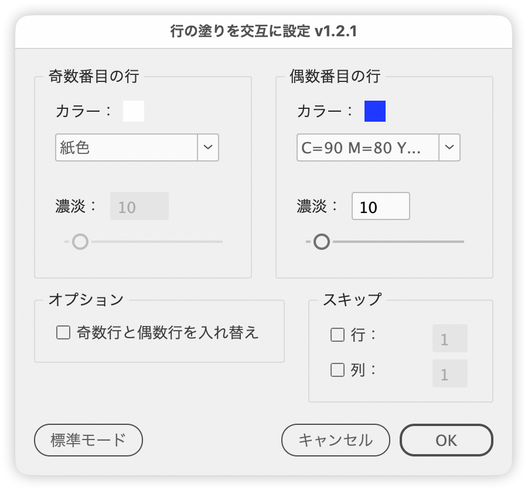

# 表の行に交互の塗り（縞模様）を適用

---

選択した表セルに、選択範囲内の行の並びを基準に交互の塗り（縞模様）をプレビュー付きで適用します。上から／左から指定した数の行・列は、塗りの対象外にできます。

## 主な機能

- ［奇数番目の行］［偶数番目の行］それぞれにカラーと濃淡（0〜100%）を設定
- 選択範囲内でよく使われているカラー・濃淡の組み合わせを、起動時の初期値に自動設定
- ［オプション］の［奇数行と偶数行を入れ替え］で、2つのパネルの設定を交換
- ［スキップ］の［行］［列］で、選択範囲の上／左から指定した数を塗りの対象外に
- 操作するたびにドキュメント上で即座にプレビュー
- 左下のボタンでドキュメントウィンドウの標準モード／プレビューを切り替え
- 数値は ↑↓ キーで ±1、Shift + ↑↓ で ±10。濃淡スライダーは通常 1%、Shift で 10%、Option で 5% 刻み
- 「なし」「紙色」を選ぶと濃淡のコントロールを自動的にディム表示
- 各コントロールにツールチップを用意

## 使い方

1. 塗りを設定したい表セルを選択する
2. スクリプトを実行する
3. カラーと濃淡、スキップする行数・列数を指定して［OK］

## オプション

| 項目 | 内容 |
| --- | --- |
| 奇数番目の行 / 偶数番目の行 | 表の行番号ではなく、選択範囲の上から数えた順番です。スキップした行は数に入りません |
| 奇数行と偶数行を入れ替え | 2つのパネルのカラーと濃淡を入れ替えます |
| スキップ：行 | 選択範囲の上から指定した行数を、塗りの対象から外します |
| スキップ：列 | 選択範囲の左から指定した列数を、塗りの対象から外します |
| 標準モード / プレビュー | ドキュメントウィンドウの画面モードを切り替えます。ボタンには切替先が表示されます |

## 制限事項・メモ

- カラーの一覧では［レジストレーション］を常に非表示にし、Paper は「紙色」、None は「なし」、Black は「黒」と表示します。
- スキップ対象のセルは、スクリプト実行前のカラー・濃淡に戻ります。
- プレビューが隠れないよう、ダイアログを開いている間はセルの選択を解除します。
- キャンセル時はプレビューで加えた変更を自動で巻き戻します。
- 取り消し（Undo）には「塗りプレビュー」「セルの塗りを交互に設定」の名前で記録されます。

## スクリプト情報

| 項目 | 内容 |
| --- | --- |
| ファイル | `jsx/table/IdZebraRowFill.jsx` |
| バージョン | v1.2.1 |
| 作者 | Masahiro Takano (@swwwitch) |
| 初回リリース | 2026-04-17 |
| 最終更新 | 2026-09-16 |
| 紹介記事 | https://note.com/dtp_tranist/n/n20ff60f6b508 |

## ライセンス

MIT License — <http://opensource.org/licenses/mit-license.php>
